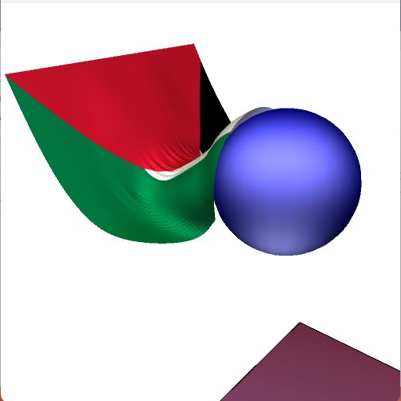
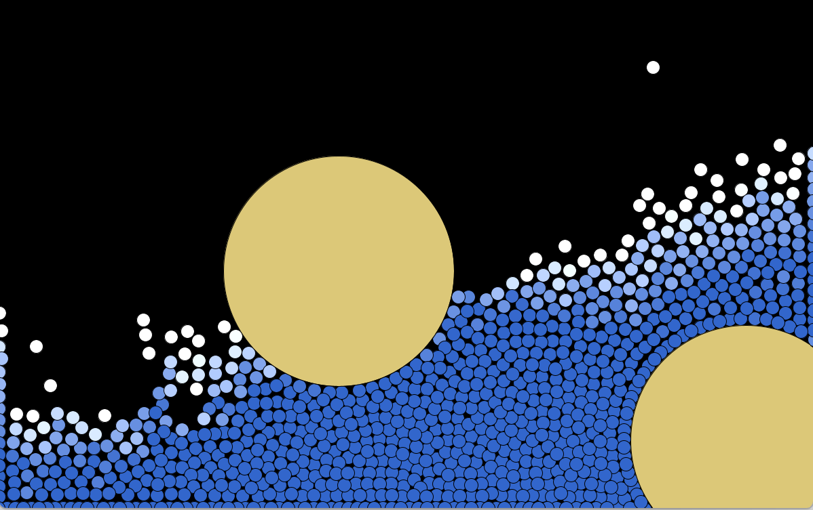

# Cloth and Water Simulations

A Rod-based cloth and SPH fluid simulations, created for CSCI 5611 by Omar Salem

## Demo TODO
[Cloth - YouTube Demo]()
[Water - YouTube Demo]()

### Cloth Features & Timestamps TODO

### Water Features & Timestamps TODO

## Difficulties Encountered TODO

## Libraries used
No external libraries outside of the provided Processing libraries were used.

## Attribution

### Code
Code can be found on the [github page](https://github.com/omsa0/Cloth-and-Water/)

All code used was either written by me or provided in class

### Images
For the cloth flag texture - [VectorFlags.com](https://vectorflags.com/palestine/ps-square-01)
